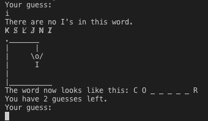
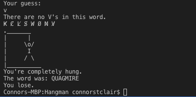

# Hangman 

## Description
Implementation of Hangman as part of the Google Tech Dev Guide [Foundations of Programming](https://techdevguide.withgoogle.com/paths/foundational/hangman-challenge-archetypal/#! "Link")

Based on [Stanford CS106A Winter 2011-2012 Assignment #4](https://web.stanford.edu/class/archive/cs/cs106a/cs106a.1124/handouts/200%20Assignment%204.pdf
 "Assignment Tasksheet")

## Screenshot

## Requirements
- Java 
- Maven

## Running the game 
From the terminal of your choice:

Clone the repository 
`git clone https://github.com/ConnorSClair/hangman.git`

change directory
`cd hangman`

Make the jar file
`mvn clean install`

Run the game 
`java -cp target/hangman-1.0-SNAPSHOT.jar com.connor.games.HangmanController`

